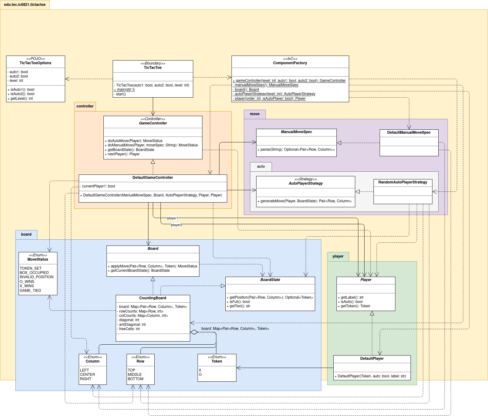
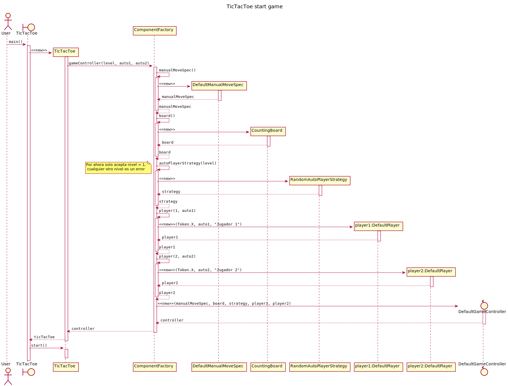
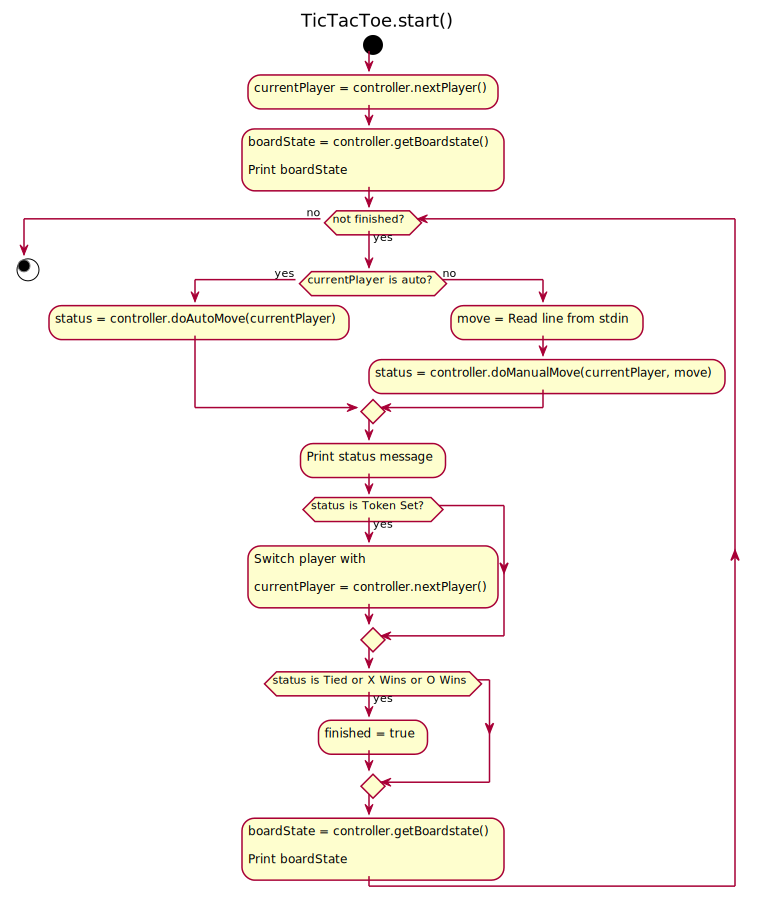
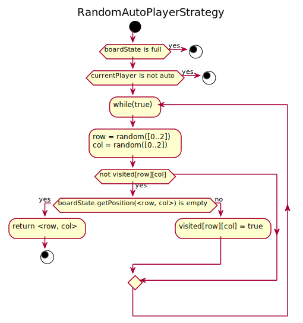
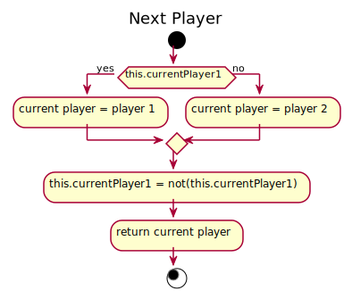

## Diagrama de clases ##

## Diagrama de secuencia: Inyección de dependencias ##

## Diagrama de actividad: Ciclo principal del juego ##

## Diagrama de actividad: Estrategia aleatoria de juego ##

## Diagrama de actividad: Intercambio de turnos en el juego ##
